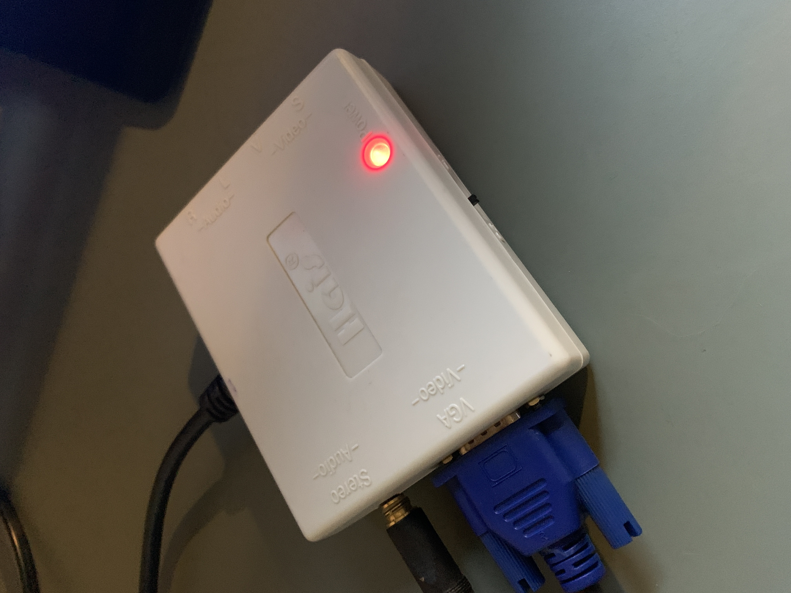
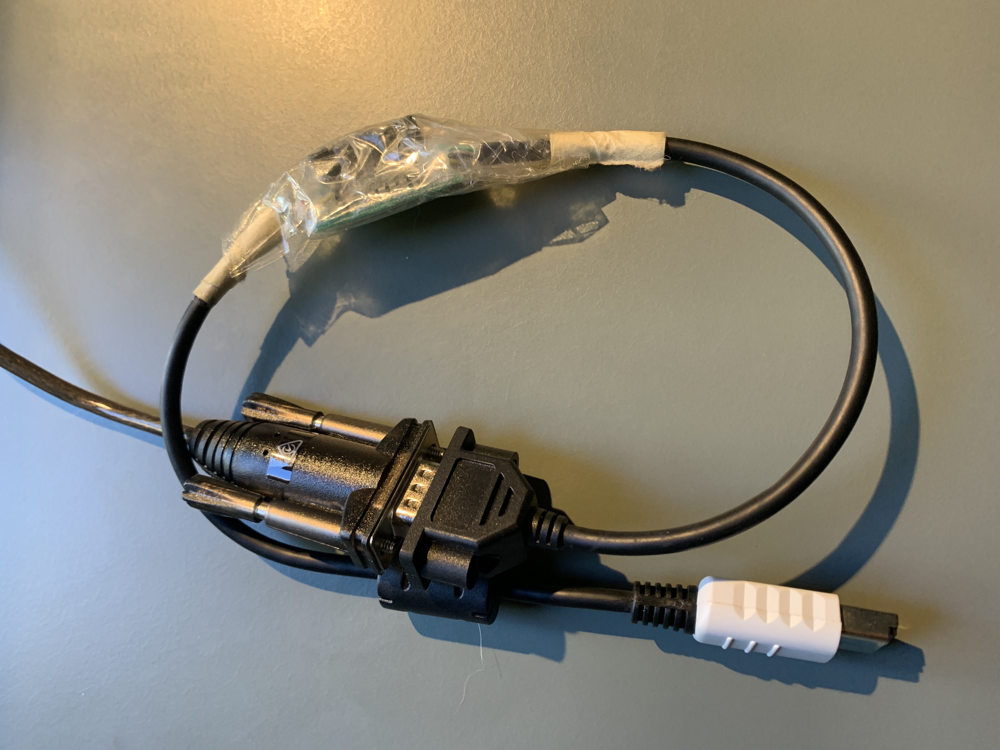

Way back in the last century, I bought a Sega Dreamcast. One of the
reasons that I like it (apart from some great games), was that there
was a burgeoning homebrew development scene for it. I went and bought
the various bits of hardware I thought I needed to get going, but ended
up never doing anything, and it all sat in storage for 20 years.

Recently, I unpacked everythying and decided to figure it all out.

## Video and audio adapters

Obviously, you need to begin with a Dreamcast console. There are a
three hardware [variants](https://dreamcast.wiki/Hardware_variations). I
have a v1, which is the most common and doesn't need BIOS hacks to run
custom software.

Since I no longer have a TV with RGB inputs, I went and bought a
[Kaico HDMI adapter](https://kaicolabs.com/product/sega-dreamcast-hdmi-display-adaptor/).
This worked really well to connect the Dreamcast to an old HP monitor
I had lying around the house. The only drawback with this adapter is
that my monitor doesn'y have any speakers, and the adapter doesn't
split the sounds output.  This means that I would need a separate HDMI
sound extractor to conect headphones. These gadgets exist, but they need
external power (usually over USB) and necessarily involve more cabling.

Fortunately, my earlier self already solved this problem. Digging around
in storage, I found that I already has a Hais VGA adapter that extracts
a VGA signal from the Dreamcast, has a 3.5mm headphone jack and doesn't need
any external power. Perfect!

<center></center>

## Development connectivity

The next thing you need is a way to connect the Dreamcast to a development
host. It seems like the best option is to get a
[Broadband Adapter](https://dreamcast.wiki/Broadband_adapter)
which lets you use local ethernet. However, these are pretty expensive,
and my earlier self had already bought a serial coder's cable. This
is an adapter that connects the Dreamcast serial interface to a host
computer. The one I have is a 9-pin RS232 serial, which was probably a
pretty good choice in 1999. However, since it's now 2023 and I don't have a
computer with a serial port any more, I needed to get a serial to USB adapter
to connect this. Remember that the serial to USB cable need host drivers to
work, so you'll need to install those too. In my case, I needed the
[PL2303](https://www.prolific.com.tw/US/ShowProduct.aspx?p_id=229&pcid=41)
driver, which seems pretty common across generic serial to USB adapter
cables.

<center></center>

## Setting up the environment

Now that we have some hardware, we need to set up the sofware development
environment. There's a lot of guides out there on how to get set up with
[KallistiOS](http://gamedev.allusion.net/softprj/kos/), and I pretty much
followed them to get started.

Once you clone [KallistiOS](https://github.com/KallistiOS/KallistiOS), read
[`utils/dc-chain/README.md`](https://github.com/KallistiOS/KallistiOS/blob/master/utils/dc-chain/README.md)
for instructions on how to build and install the cross-compilation toolchain.

Now that you have build the SH4 toolchain, we need to build dcload to be
able to send programs to the Dreamcast over the serial adapter. dcload has
a server, which runs on the Dreamcast, and a client that sends programs
for the server to load. There are separate versions of dcload for serial
([dcload-serial](https://github.com/KallistiOS/dcload-serial))
and IP
([dcload-ip](https://github.com/KallistiOS/dcload-ip))
transports. Since I'm using a serial adapter, I needed `dcload-serial`.

To build the `dcload-serial` server, you will end up needing to burn a CD
image. The makefiles in the `dcload-serial` repository can do this, but I
needed a few tweaks.

First, install prerequisites with Homebrew:
```bash
$ brew install cdrtools libelf
```

Next, ensure that the `KOS_BASE` environment variable contains the full path to
your KallistiOS source tree. In that tree, you need to build the
[`utils/scramble`](https://github.com/KallistiOS/KallistiOS/tree/master/utils/scramble)
tool. The `dcload-serial` server build will end up trying to exec
`$(KOS_BASE)/utils/scramble/scramble`.

I ended up building it with a make invocation like this:
```bash
$ make HOSTCC=cc KOS_BASE=/Users/jpeach/upstream/dc/kallistios
...
```

Now, to actually burn a disc with the `dcload-serial` server, you need to know
SCSI ID from `cdrecord`. In my case it is `1,0,0` which I just got from running
`cdrecord -scanbus`:
```bash
$ cdrecord -scanbus
Cdrecord-ProDVD-ProBD-Clone 3.02a09 (x86_64-apple-macosx21.1.0) Copyright (C) 1995-2016 Joerg Schilling
Using libscg version 'schily-0.9'.
scsibus1:
  1,0,0 100) 'HL-DT-ST' 'DVDRAM GP08NU20 ' '1.00' Removable CD-ROM
  1,1,0 101) *
  1,2,0 102) *
  1,3,0 103) *
  1,4,0 104) *
  1,5,0 105) *
  1,6,0 106) *
  1,7,0 107) *
```

To burn the CD, I needed to replace the names of Linux-only tools in the
Makefile and temporarily disable `distarbitrationd`. The latter operation is
needed when burning multi-session discs with multiple invocations of
`cdrecord`.

```bash
$ sudo kill -STOP $(pgrep diskarbitrationd)
$ make -C make-cd distclean
$ make -C make-cd CDRECORD="cdrecord dev=1,0,0 speed=8" MKISOFS=mkisofs
$ sudo kill -CONT $(pgrep diskarbitrationd)
```

So after this, I have a CD that will boot and load the `dcload-serial` server,
and I have a host-side tool named `dc-tool-ser` which will send programs to it
over the serial adapter. It's not very clear to me why all these tools aren't
collapsed into one package, but I guess there's some historyical reasons for
it.

## Loading a program

OK, so now that we have done all that, we can put it together and load a
program.

Building code in KallistiOS depends on setting up a whole slew of environment
variables that are expected to be set by `$KOS_BASE/environ.sh`. You create
this file by copying the
[sample](https://github.com/KallistiOS/KallistiOS/blob/master/doc/environ.sh.sample).
In my setup, I use [direnv](https://direnv.net) to automatically source this when I'm
in the KallistiOS source tree:

```bash
$ cat .envrc
source environ.sh
```

We are going to build and load
[`examples/dreamcast/kgl/basic/elements`](https://github.com/KallistiOS/KallistiOS/tree/master/examples/dreamcast/kgl/basic/elements).
This depends on the Dreamcast OpenGL port from
[KOS Ports](https://github.com/KallistiOS/kos-ports), so first we need to build and
install that.

When you are in a KallistiOS development environment (i.e. have
`$KOS_BASE/environ.sh` sourced), you should have a `$KOS_PORTS`
environment variable that contains the full path to your copy of the
`kos-ports` respository. You can build any of the ports in `kos-ports` using
the `install` make target:

```bash
$ make -C $KOS_PORTS/libGL install
libGL is not currently installed.
Finished processing dependencies for libGL.
Fetching libGL from git://git.code.sf.net/p/cadcdev/libgl ...
Cloning into 'libGL-2.0.0'...
remote: Enumerating objects: 299, done.
remote: Counting objects: 100% (299/299), done.
remote: Compressing objects: 100% (295/295), done.
remote: Total 299 (delta 181), reused 0 (delta 0)
Receiving objects: 100% (299/299), 135.58 KiB | 690.00 KiB/s, done.
Resolving deltas: 100% (181/181), done.
Copying SCM checkout of libGL ...
Copying KOS files...
kos-cc  -c gl-rgb.c -o gl-rgb.o
kos-cc  -c gl-fog.c -o gl-fog.o
kos-cc -c gl-sh4-light.S -o gl-sh4-light.o
kos-cc  -c gl-light.c -o gl-light.o
kos-cc  -c gl-clip.c -o gl-clip.o
kos-cc  -c gl-clip-arrays.c -o gl-clip-arrays.o
kos-cc  -c gl-arrays.c -o gl-arrays.o
kos-cc  -c gl-pvr.c -o gl-pvr.o
kos-cc  -c gl-matrix.c -o gl-matrix.o
gl-matrix.c:306:27: warning: argument 1 of type ‘float[3]’ with mismatched bound [-Warray-parameter=]
  306 | void glhLookAtf2(vector3f eyePosition3D,
      |                  ~~~~~~~~~^~~~~~~~~~~~~
In file included from gl-matrix.c:19:
include/glu.h:42:42: note: previously declared as ‘float *’
   42 | GLAPI void APIENTRY glhLookAtf2(GLfloat *eyePosition3D,
gl-matrix.c:307:27: warning: argument 2 of type ‘float[3]’ with mismatched bound [-Warray-parameter=]
  307 |                  vector3f center3D,
      |                  ~~~~~~~~~^~~~~~~~
include/glu.h:43:42: note: previously declared as ‘float *’
   43 |                                 GLfloat *center3D,
gl-matrix.c:308:27: warning: argument 3 of type ‘float[3]’ with mismatched bound [-Warray-parameter=]
  308 |                  vector3f upVector3D) {
      |                  ~~~~~~~~~^~~~~~~~~~
include/glu.h:44:42: note: previously declared as ‘float *’
   44 |                                 GLfloat *upVector3D);
kos-cc  -c gl-api.c -o gl-api.o
kos-cc  -c gl-texture.c -o gl-texture.o
kos-cc  -c glu-texture.c -o glu-texture.o
kos-cc  -c gl-framebuffer.c -o gl-framebuffer.o
kos-cc  -c gl-cap.c -o gl-cap.o
kos-cc  -c gl-error.c -o gl-error.o
rm -f libGL.a
/opt/toolchains/dc/sh-elf/bin/sh-elf-gcc-ar rcs libGL.a gl-rgb.o gl-fog.o gl-sh4-light.o gl-light.o gl-clip.o gl-clip-arrays.o gl-arrays.o gl-pvr.o gl-matrix.o gl-api.o gl-texture.o glu-texture.o gl-framebuffer.o gl-cap.o gl-error.o
touch build-stamp
Installing...
Marking libGL 2.0.0 as installed.
```

Now, back in
[`examples/dreamcast/kgl/basic/elements`](https://github.com/KallistiOS/KallistiOS/tree/master/examples/dreamcast/kgl/basic/elements),
we can build and load the example. Note the name of the USB serial port.

```bash
$ make
rm -f gl-elements.elf romdisk.*
kos-cc  -c gl-elements.c -o gl-elements.o
kos-cc  -c pvr-texture.c -o pvr-texture.o
/Users/jpeach/upstream/dc/kallistios/utils/genromfs/genromfs -f romdisk.img -d romdisk -v
0    rom 1684290961       [0xffffffff, 0xffffffff] 0177777, sz     0, at 0x0
1    .                    [0x1000004 , 0x76d1d3e ] 0040755, sz     0, at 0x20
1    ..                   [0x1000004 , 0x76d1d3a ] 0040755, sz     0, at 0x40     [link to 0x20    ]
1    wp001vq.pvr          [0x1000004 , 0x76d1d3f ] 0100644, sz 67616, at 0x60
/Users/jpeach/upstream/dc/kallistios/utils/bin2o/bin2o romdisk.img romdisk romdisk.o
kos-cc -o gl-elements.elf gl-elements.o pvr-texture.o romdisk.o -L/Users/jpeach/upstream/dc/kallistios/lib -lGL -lm
$ make run KOS_LOADER="dc-tool-ser -t /dev/cu.usbserial-DTDDb115819 -b 115200 -x"
dc-tool-ser -t /dev/cu.usbserial-DTDDb115819 -b 115200 -x gl-elements.elf
Console enabled
Changing speed to 115200 bps... done
Upload <gl-elements.elf>
File format is ELF, start address is 0x8c010000
Section .text, lma 0x8c010000, size 273860
send_data: CCCCCCCCCCCCCCCCC
Section .init, lma 0x8c052dc4, size 54
send_data: U
Section .fini, lma 0x8c052dfc, size 42
send_data: U
Section .rodata, lma 0x8c052e28, size 101576
send_data: CCCCCCC
Section .eh_frame, lma 0x8c06baf0, size 452
send_data: C
Section .ctors, lma 0x8c06bd34, size 8
send_data: U
Section .dtors, lma 0x8c06bd3c, size 8
send_data: U
Section .data, lma 0x8c06bd60, size 12908
send_data: C
Section .got, lma 0x8c06efcc, size 12
send_data: U
effective: 14799.54 bytes / sec
26.28 seconds to transfer 388920 bytes
Executing at <0x8c010000>
Sending execute command (0x8c010000, console=1)...executing

--
KallistiOS Git revision 9ed32290-dirty:
  Mon May  1 11:45:17 AEST 2023
  jpeach@smelt.local:/Users/jpeach/upstream/kallistios
  sh-elf-gcc (GCC) 12.2.0
maple: active drivers:
    Dreameye (Camera): Camera
    Sound Input Peripheral: Microphone
    PuruPuru (Vibration) Pack: JumpPack
    VMU Driver: Clock, LCD, MemoryCard
    Mouse Driver: Mouse
    Keyboard Driver: Keyboard
    Controller Driver: Controller
    Lightgun: LightGun
  DMA Buffer at ac30c5e0
vid_set_mode: 640x480 VGA
fs_romdisk: mounting image at 0x8c052e8c at /rd
dc-load console support enabled
maple: attached devices:
  A0: Dreamcast Controller          (01000000: Controller)
pvr: disabling vertical scaling for VGA
^Cmake: *** [run] Interrupt: 2
```

I don't think there's a way to exit this demo, so killing the host-side
loader just disconnects the serial console, leaving it running.

So by the end of this, we have the Dreamcast hardware connected, a working
compiler toolchain, and we know how to load KallistiOS programs over the
serial interface. There's a lot of information on Dreamcast development
out there, but I found there are still a few sharp corners. Seeing the
output from various tools was pretty helpful in setting my expectations
and knowing that I was on the right track.

